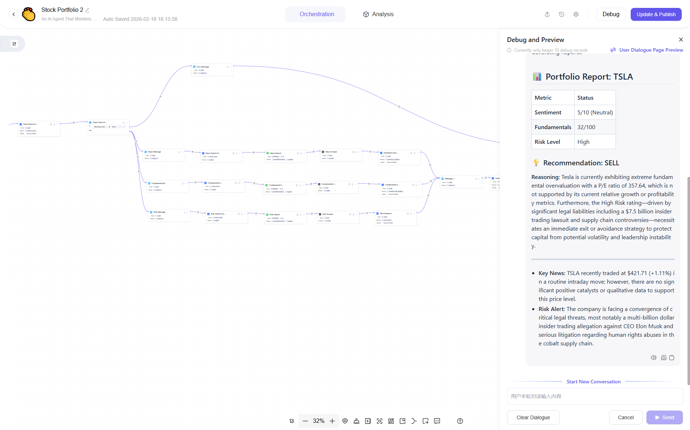

# 📈 AI Stock Portfolio Analyst (Astron Agent Workflows)

This repository contains two powerful financial analysis workflows built for **Astron Agent**. These agents act as an autonomous research team, capable of analyzing market sentiment, fundamental health, and systemic risks for any public company.

## 📂 Included Workflows

### 1. 🚀 Extended Stock Portfolio (Autonomous)
*The "Pro" version. Fully automated from ticker to final report.*

This workflow is designed for complete automation. You simply provide a company name, and the agent handles the rest.

**Key Features:**
* **Smart Stock Extraction:** Uses an LLM to identify tickers from natural language (e.g., "Tell me about Apple" → `AAPL`). Includes a logic loop to ask for clarification if no stock is found.
* **Parallel Processing:** simultaneously runs three distinct research branches to save time:
    1.  **News Aggregator:** Searches for the latest headlines and social sentiment (Reddit/X).
    2.  **Fundamental Analyst:** Retrieves hard financial metrics (P/E, Revenue, Earnings).
    3.  **Risk Assessor:** Scans for "negative" keywords like lawsuits, regulatory probes, and leadership scandals.
* **Automated Scraping:** Uses Python (via Jina AI) to visit search results and extract full article text for deep analysis.
* **Synthesis:** Merges all data into a professional "Buy/Hold/Sell" executive summary.

**Best for:** Users who want a daily automated briefing without manually searching for news.

---

### 2. 📝 Stock Portfolio (Manual Input)
*The "Lite" version. Human-in-the-loop analysis.*

This workflow focuses purely on the **analysis logic** without the external searching.

**How it works:**
* The agent asks you to paste specific text (e.g., a news article, an earnings report, or a rumor).
* It analyzes the text using the same specialized prompts (Sentiment, Fundamentals, Risk).
* It generates a report based strictly on the data you provided.

**Best for:** Users without API keys, or when you want to analyze a specific document/email that is not public on the web.

---

## 🛠️ Prerequisites & Setup

To run the **Extended Stock Portfolio** workflow, you need to configure two external tools in Astron Agent.

### 1. Google Search Tool (Serper)
Used to find the latest news URLs.
* **Provider:** [Serper.dev](https://serper.dev) (Free tier available).
* **Astron Setup:**
    * Create a new Tool named `Google Search`.
    * **Endpoint:** `https://google.serper.dev/search`
    * **Headers:** `X-API-KEY` (Your Serper Key).
    * **Body Parameter:** `q` (The search query).

### 2. Web Scraper (Python Node)
Used to read the content of the found URLs.
* **Method:** Python Node using standard `requests`.
* **Recommendation:** Use [Jina.ai](https://jina.ai/) as a proxy to convert websites to clean Markdown.
* **Dependencies:** `requests` (usually pre-installed).

---

## 📥 Installation

1.  **Download:** Get the `.json` (or `.dsl`) workflow files from this repository.
2.  **Import:** Open Astron Agent → click **Import Workflow**.
3.  **Configure Keys:**
    * Open the **Extended Stock Portfolio** workflow.
    * Click on the **Google Search** nodes and ensure your specific Tool is selected.
    * Open the **Python/Scraper** nodes and paste your Jina API key (if using the paid tier) or ensure the script matches your setup.
4.  **Run:** Click the "Run" button and enter a stock name (e.g., "Nvidia").

## ⚠️ Disclaimer

**This tool is for informational and educational purposes only.**
The "Buy/Sell/Hold" recommendations generated by this AI are based on linguistic analysis of news and data. They do **not** constitute professional financial advice. Always do your own due diligence before investing.

---

### 📷 Visuals

*The Extended Workflow architecture showing parallel execution branches.*
